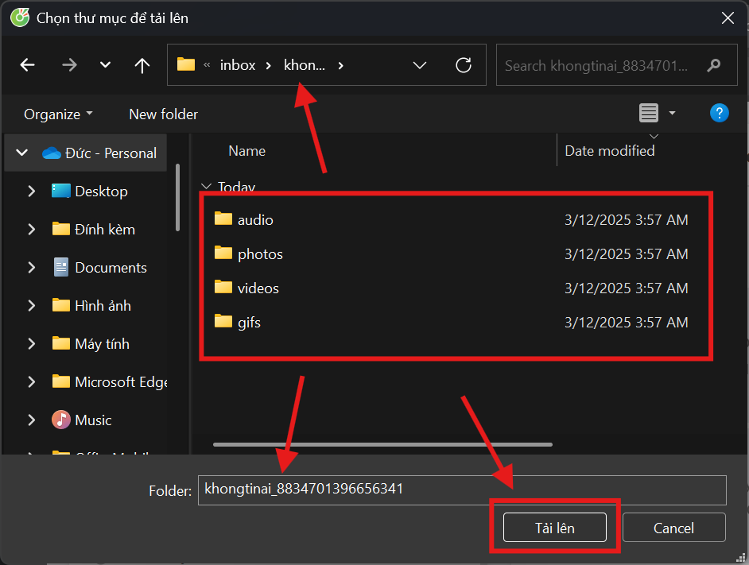
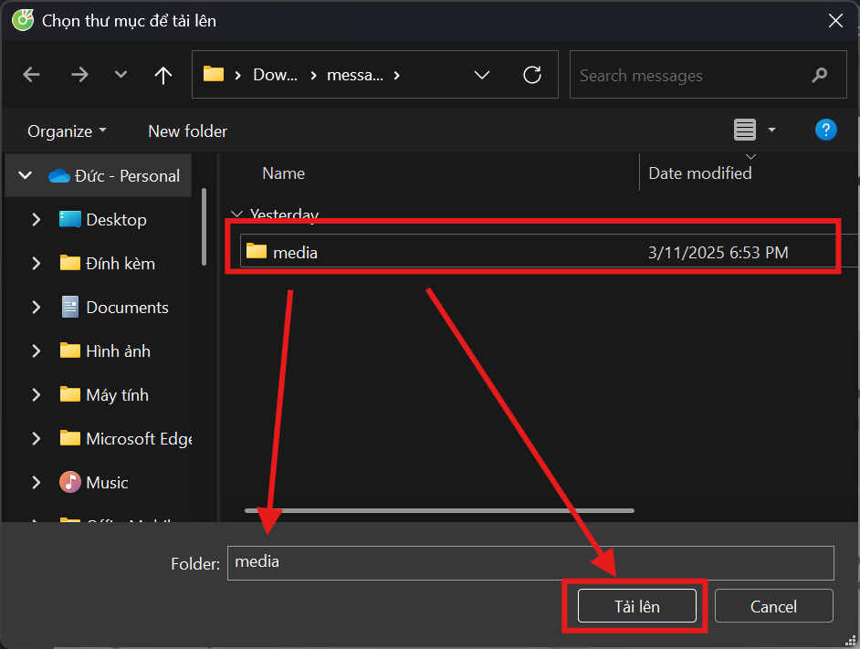
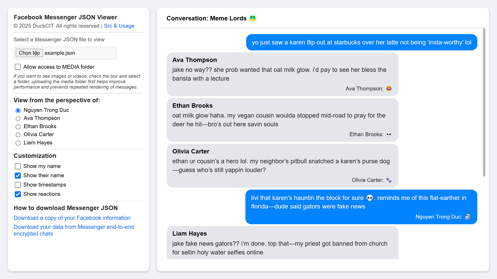

# Facebook Messenger JSON Viewer

## Overview
The Facebook Messenger JSON Viewer is a tool designed to help users view and analyze their Facebook Messenger data in a more readable format. This tool converts JSON files exported from Facebook Messenger into an easy-to-navigate interface.

## Features
- **JSON Parsing**: Efficiently parses JSON files.
- **User-Friendly Interface**: Displays messages in a clean and organized manner.
- **Media Support**: Allows viewing of images, videos, and audio files.
- **Customization Options**: Provides options to show/hide timestamps, sender names, and reactions.
- **Responsive Design**: Adapts to different screen sizes for better usability on mobile devices.

## Usage
1. Export your Facebook Messenger data from Facebook.
2. Upload the JSON file to the Facebook Messenger JSON Viewer on our [GitHub Page](https://duckcit.github.io/Facebook-Messenger-JSON-Viewer).
3. **If you want to view images, videos, and audio, you must select Allow access to MEDIA folder and choose the folder containing the Messenger JSON file**

**There are two cases for the media folder as follows**
1. Download JSON from Facebook, select the message folder (containing the JSON file)

2. Download JSON from Messenger end-to-end, select the media folder

## Detailed Features

### JSON Parsing
The tool efficiently parses JSON files exported from Facebook Messenger, ensuring that the data is accurately represented in the viewer.

### Customization Options
Users can customize the display of messages with the following options:
- **Show My Name**: Display or hide the user's name in the messages.
- **Show Their Name**: Display or hide the other participants' names in the messages.
- **Show Timestamps**: Display or hide the timestamps of the messages.
- **Show Reactions**: Display or hide reactions to the messages.

**DEMO**

## License
This project is licensed under the MIT License. See the [LICENSE](LICENSE) file for more information.

## Contact
For any questions or feedback, please contact us at duckcitvn@gmail.com
